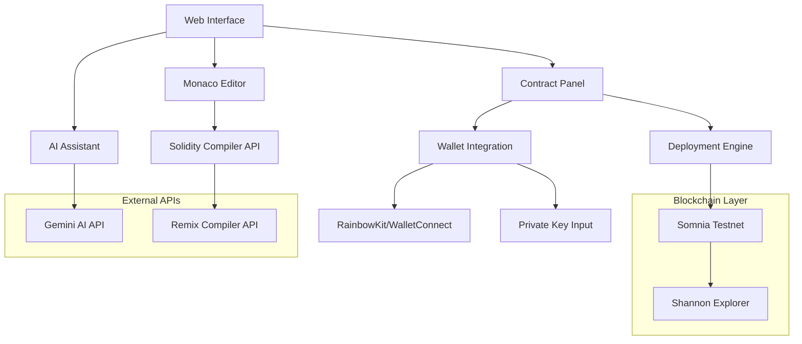
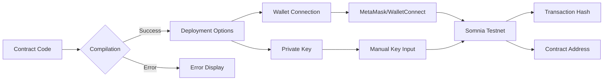
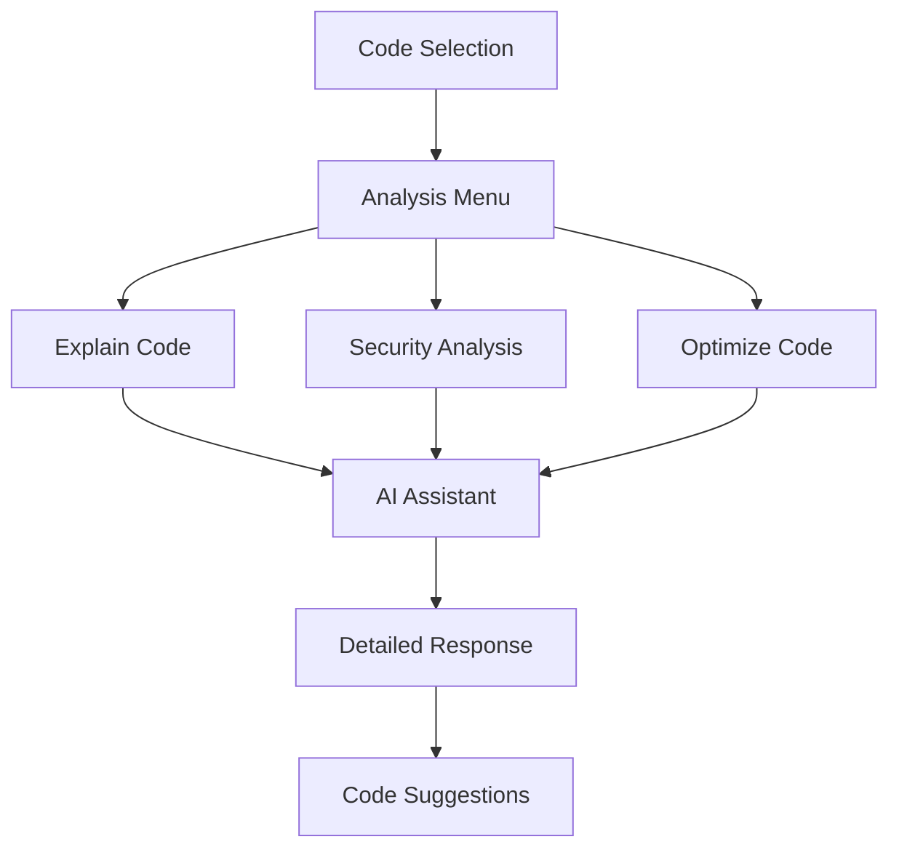
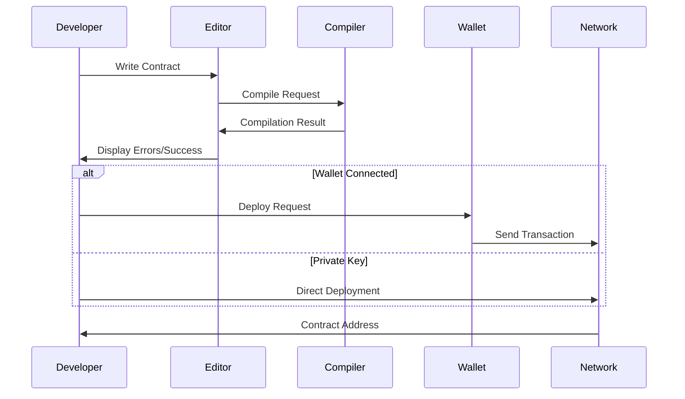
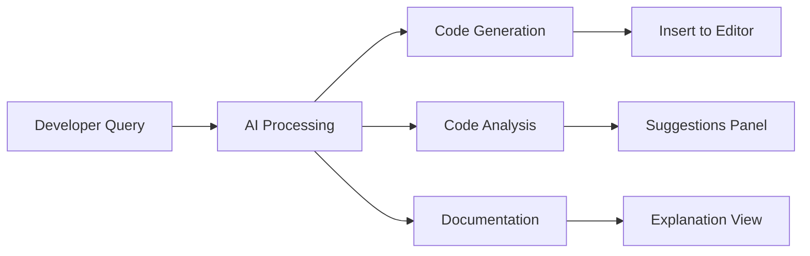

# Somnia Playground

A web-based development environment for Solidity smart contracts on the Somnia blockchain testnet. Provides compilation, deployment, and AI-assisted development tools.

## Architecture



## System Components

### Frontend Architecture
- **Next.js 14**: React framework with App Router
- **TypeScript**: Type-safe development
- **Tailwind CSS**: Utility-first styling
- **Monaco Editor**: VS Code editor integration

### Blockchain Integration
- **ethers.js v6**: Ethereum library for contract interaction
- **RainbowKit**: Wallet connection interface
- **wagmi**: React hooks for Ethereum
- **viem**: TypeScript Ethereum library

### AI Integration
- **Gemini API**: Google's generative AI for code assistance
- **Code Analysis**: Real-time contract review and suggestions
- **Context-Aware**: Understands Somnia-specific development patterns

## Network Configuration

### Somnia Testnet Parameters
```javascript
{
  chainId: 50312,
  name: "Somnia Testnet",
  rpcUrl: "https://dream-rpc.somnia.network",
  blockExplorer: "https://shannon-explorer.somnia.network",
  nativeCurrency: {
    name: "STT",
    symbol: "STT",
    decimals: 18
  }
}
```

## Installation

### Prerequisites
- Node.js 18.0 or higher
- npm or yarn package manager

### Setup Process
```bash
# Clone repository
git clone <repository-url>
cd somnia-playground

# Install dependencies
npm install

# Configure environment
cp .env.local.example .env.local

# Start development server
npm run dev
```

### Environment Configuration
```env
# Blockchain Network
NEXT_PUBLIC_CHAIN_ID=50312
NEXT_PUBLIC_RPC_URL=https://dream-rpc.somnia.network
NEXT_PUBLIC_EXPLORER_URL=https://shannon-explorer.somnia.network

# AI Integration
GEMINI_API_KEY=your_gemini_api_key

# Wallet Integration
NEXT_PUBLIC_WALLETCONNECT_PROJECT_ID=your_project_id

# Optional: Server-side deployment
PRIVATE_KEY=your_private_key
```

## Core Features

### Smart Contract Development
- **Syntax Highlighting**: Solidity language support with Monaco Editor
- **Real-time Compilation**: Integrated Solidity compiler with error reporting
- **OpenZeppelin Support**: Import and use OpenZeppelin contracts
- **Template Library**: Pre-built contract templates

### Deployment Options


### AI Assistant Capabilities
- **Code Generation**: Create complete smart contracts
- **Code Analysis**: Security and optimization reviews
- **Documentation**: Explain contract functionality
- **Somnia-Specific**: Network-aware development guidance

### Code Analysis Features


## API Endpoints

### Contract Compilation
```http
POST /api/compile
Content-Type: application/json

{
  "source": "pragma solidity ^0.8.19; contract Example {}",
  "contractName": "Example"
}
```

**Response:**
```json
{
  "success": true,
  "abi": [...],
  "bytecode": "0x608060405...",
  "contractName": "Example"
}
```

### Contract Deployment
```http
POST /api/deploy
Content-Type: application/json

{
  "bytecode": "0x608060405...",
  "abi": [...],
  "privateKey": "0x..."
}
```

### AI Assistant
```http
POST /api/gemini-assistant
Content-Type: application/json

{
  "message": "Write an ERC20 token contract",
  "contractCode": "existing code context"
}
```

## Development Workflow

### Contract Development Process


### AI-Assisted Development


## Project Structure

```
src/
├── app/
│   ├── api/
│   │   ├── compile/          # Solidity compilation
│   │   ├── deploy/           # Contract deployment
│   │   ├── gemini-assistant/ # AI integration
│   │   └── list-models/      # Available AI models
│   ├── globals.css           # Global styles
│   ├── layout.tsx            # Root layout
│   └── page.tsx              # Main application
├── components/
│   ├── AIAssistant.tsx       # AI chat interface
│   ├── CodeAnalysisMenu.tsx  # Code selection analysis
│   ├── CodeEditor.tsx        # Monaco editor wrapper
│   ├── ContractPanel.tsx     # Compilation/deployment UI
│   ├── Providers.tsx         # Context providers
│   └── WalletConnect.tsx     # Wallet integration
├── hooks/
│   └── useContractDeploy.ts  # Deployment logic
└── lib/
    └── wagmi.ts              # Blockchain configuration
```

## Smart Contract Templates

### ERC20 Token with OpenZeppelin
```solidity
// SPDX-License-Identifier: MIT
pragma solidity ^0.8.19;

import "@openzeppelin/contracts/token/ERC20/ERC20.sol";
import "@openzeppelin/contracts/access/Ownable.sol";

contract SomniaToken is ERC20, Ownable {
    constructor() ERC20("Somnia Token", "SOM") {
        _mint(msg.sender, 1000000 * 10**decimals());
    }
    
    function mint(address to, uint256 amount) public onlyOwner {
        _mint(to, amount);
    }
}
```

### NFT Contract
```solidity
// SPDX-License-Identifier: MIT
pragma solidity ^0.8.19;

import "@openzeppelin/contracts/token/ERC721/ERC721.sol";
import "@openzeppelin/contracts/access/Ownable.sol";

contract SomniaNFT is ERC721, Ownable {
    uint256 private _tokenIdCounter;
    
    constructor() ERC721("Somnia NFT", "SNFT") {}
    
    function safeMint(address to) public onlyOwner {
        uint256 tokenId = _tokenIdCounter++;
        _safeMint(to, tokenId);
    }
}
```

## Testing and Deployment

### Local Development
```bash
# Start development server
npm run dev

# Build for production
npm run build

# Start production server
npm start
```

### Contract Testing
```bash
# Compile contracts
npm run compile

# Run tests
npm run test

# Deploy to testnet
npm run deploy
```

## Security Considerations

### Private Key Management
- Never commit private keys to version control
- Use environment variables for sensitive data
- Consider hardware wallets for production

### Smart Contract Security
- Use OpenZeppelin audited contracts
- Implement proper access controls
- Test thoroughly before mainnet deployment
- Consider professional audits for production contracts

## Performance Optimization

### Frontend Optimization
- Code splitting with Next.js
- Lazy loading of components
- Optimized bundle size

### Blockchain Interaction
- Gas estimation before deployment
- Transaction batching where applicable
- Efficient contract design patterns

## Troubleshooting

### Common Issues
1. **Compilation Errors**: Check Solidity version compatibility
2. **Deployment Failures**: Verify network configuration and gas settings
3. **Wallet Connection**: Ensure correct network is selected
4. **AI Assistant**: Verify API key configuration

### Debug Information
- Check browser console for errors
- Monitor network requests in developer tools
- Verify environment variable configuration

## Contributing

### Development Guidelines
1. Follow TypeScript best practices
2. Maintain component modularity
3. Write comprehensive tests
4. Document API changes

### Pull Request Process
1. Fork the repository
2. Create feature branch
3. Implement changes with tests
4. Submit pull request with description

## License

MIT License - see LICENSE file for details.