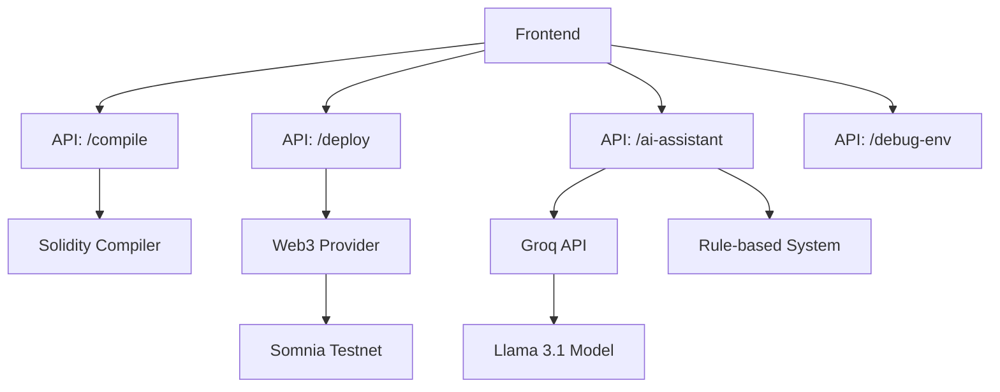
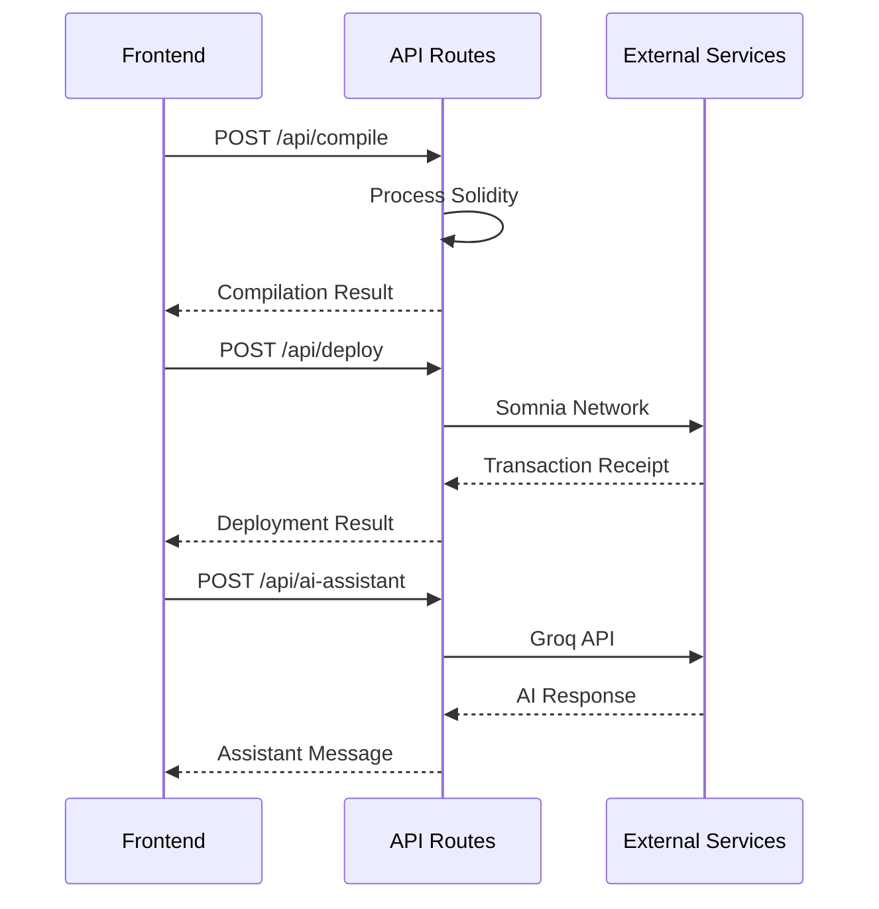

# API Endpoints Documentation

## API Architecture

## Endpoint Details

### /api/compile
- **Method**: POST
- **Purpose**: Compile Solidity contracts
- **Input**: Contract source code
- **Output**: Bytecode, ABI, errors

### /api/deploy
- **Method**: POST
- **Purpose**: Deploy contracts to Somnia
- **Input**: Bytecode, private key, constructor args
- **Output**: Contract address, transaction hash

### /api/ai-assistant
- **Method**: POST
- **Purpose**: AI-powered development assistance
- **Input**: User message, contract code, conversation history
- **Output**: AI response with Somnia-specific guidance

### /api/debug-env
- **Method**: GET
- **Purpose**: Debug environment variables
- **Output**: Environment status, API key presence

## Data Flow

