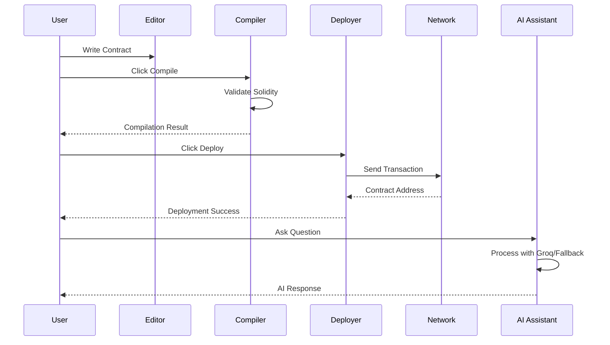
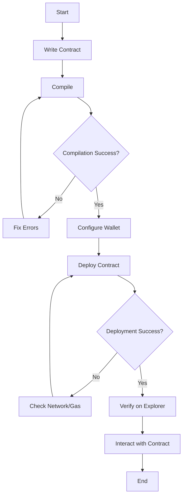
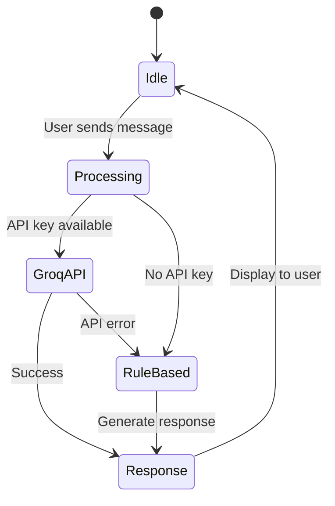

# User Flow Documentation

## Development Workflow

```mermaid
sequenceDiagram
    participant U as User
    participant E as Editor
    participant C as Compiler
    participant D as Deployer
    participant N as Network
    participant A as AI Assistant
    
    U->>E: Write Contract
    U->>C: Click Compile
    C->>C: Validate Solidity
    C-->>U: Compilation Result
    
    U->>D: Click Deploy
    D->>N: Send Transaction
    N-->>D: Contract Address
    D-->>U: Deployment Success
    
    U->>A: Ask Question
    A->>A: Process with Groq/Fallback
    A-->>U: AI Response
```

## Contract Development Process

```mermaid
flowchart TD
    A[Start] --> B[Write Contract]
    B --> C[Compile]
    C --> D{Compilation Success?}
    D -->|No| E[Fix Errors]
    E --> C
    D -->|Yes| F[Configure Wallet]
    F --> G[Deploy Contract]
    G --> H{Deployment Success?}
    H -->|No| I[Check Network/Gas]
    I --> G
    H -->|Yes| J[Verify on Explorer]
    J --> K[Interact with Contract]
    K --> L[End]
```

## AI Assistant Interaction

```mermaid
stateDiagram-v2
    [*] --> Idle
    Idle --> Processing: User sends message
    Processing --> GroqAPI: API key available
    Processing --> RuleBased: No API key
    GroqAPI --> Response: Success
    GroqAPI --> RuleBased: API error
    RuleBased --> Response: Generate response
    Response --> Idle: Display to user
```